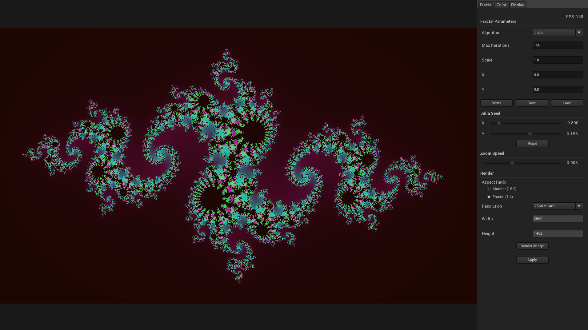

# Retorn
...

## Images
 
<p align="center">
  
   
</p>

## Technology
  - [LWJGL 3](https://github.com/LWJGL/lwjgl3)
  - [LWJGUI](https://github.com/orange451/LWJGUI)
  - [Log4j](https://github.com/apache/log4j)
  - [Gson](https://github.com/google/gson)

## Running
1. Download the latest release.
2. Place the jar file and resources folder in the same directory.
3. Run the application:

```
java -jar retorn.jar
```

## Usage

### Key Bindings
| Command | Key 1 | Key 2 |
| --- | --- | --- |
| Drag | LMB | |
| Zoom In | RMB | Scroll Up |
| Zoom Out | Shift + RMB | Scroll Down |
| Toggle GUI | F1 | |

## License
[](https://www.gnu.org/licenses/gpl-3.0)
